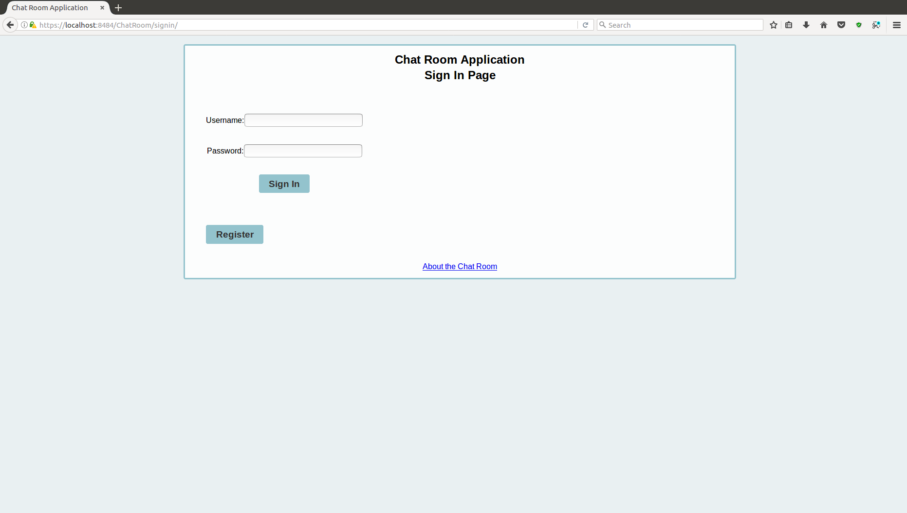
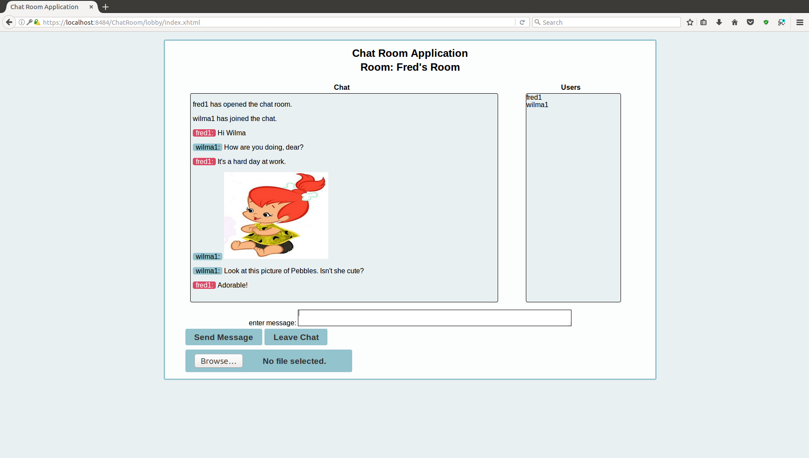

# chat-room

## System Overview

This chat room application provides functionality to support multiple chat rooms running on WebSockets.  For the Maven version of this project, see [chat-room-maven](https://github.com/bryandaniel1/chat-room-maven "chat-room-maven").  The application includes a registration process for users to create accounts and a sign-in process for users to enter a lobby where chat sessions can be created or joined.  A history page is available for users to view previous conversations.  Users with the administrator role have access to the administrator page where user accounts can be activated or deactivated and email messages can be written and sent to users.  A timed job is also run daily to produce spreadsheet records of chat histories.

<figure>
  
  <figcaption>Figure 1. Sign In</figcaption>
</figure> 
 
<figure>
  
  <figcaption>Figure 2. Chat Room</figcaption>
</figure> 
 

## Purpose

The purpose of this repository is to provide example implementations of various technologies in Java.  The source code may also be a reference for JQuery and MySQL statements as these languages were also used in the development of this application.  Some of the technologies used in the source code are listed below.

	a) Java Server Faces (JSF)
	b) Enterprise Java Beans (EJB)
	c) Java Persistence API (JPA)
	d) WebSockets
	e) EJB Timer Service
	f) Concurrency Utilities for Java EE
	g) jBCrypt
	h) OmniFaces
	i) Apache Commons Email

## Setup and Run Instructions

### Contents

	Section A - requirements

	Section B - build MySQL database

	Section C - configuration

	Section D - build application

	Section E - deploy application

	Section F - notes

### Section A - requirements

**a)** Download and install MySQL Community Server 5.7 and Workbench from 

http://dev.mysql.com/downloads/

**b)** Download the MySQL Connector from 

https://dev.mysql.com/downloads/connector/j/

**c)** Download and install JDK 8 from 

http://www.oracle.com/technetwork/java/javase/downloads/index.html

**d)** Download and install NetBeans 8 IDE with GlassFish Server from

https://netbeans.org/downloads/

### Section B - build MySQL database

**a)** In Workbench, open and execute the file named "chatroom_db.sql".

### Section C - configuration

**a)** System Properties

 - To run the application server administration console, you can use the IDE or start a standalone installation. 

        To use the IDE, perform the following steps.

		- In the Services view of NetBeans, expand the Servers node, right-click the GlassFish Server, and select "Start".

        To use a standalone installation, perform these steps.

        - Navigate to the installation directory in a terminal and execute "/bin/asadmin start-domain".

 - The application requires a system property defining the location of the configuration file required by the application.  To establish this property, you can use the following procedure.

		- Once the Server has started, navigate to http://localhost:4848/ to open the GlassFish Console.

		- Select "server" from the Common Tasks menu and select the "Properties" tab to view system properies.

		- Click on the "Add Property" button and add a property with a name of "chatroom-config" and a value as the full path to the chatroom-config.xml.

 - The application also requires a system property defining the encryption key for the administrator email password.  To establish this property, complete the steps below.

		- The encryption key is a 16-character string used to decrypt the administrator email password using the AES algorithm.  Determine what the key should be.

		- In the system properties page of the GlassFish Console, add a new property with the name, "chatroom-encryption-key", and the value of the 16-character string.

**b)** JDBC Configuration

 - Extract the downloaded MySQL Connector and relocate the JAR file to the /glassfish/domains/domain1/lib/ext folder of the GlassFish installation.

 - To configure the database connectivity for the application, remain in the GlassFish Console to perform the next steps.
 
 		 - Expand the "Resources" node in the Common Tasks menu and select "JDBC Connection Pools" within the "JDBC" menu option.
		 
		 - Click "New..." to create a new connection pool.
		 
		 - In the "New JDBC Connection Pool" page, enter "ChatRoomPool" for the new pool name, "javax.sql.DataSource" as the resource type, and "MySql" as the database driver vendor.  For newer versions of the MySQl driver, the datasource classname may need to be updated; for version 8.0.17, the classname is "com.mysql.cj.jdbc.MysqlDataSource". Click "Next".
		 
		 - Accept all default values by clicking "Finish".
		 
		 - Select the newly created connection pool from the JDBC Connection Pools page.
		 
		 - Select the "Additional Properties" tab and add the following properties.
		 
	| Name  | Value |
	| ------ | ----- |
	| serverName  | localhost |
	| portNumber  | 3306  |
	| databaseName  | chat_room  |
	| user  | chat_room_db_user  |
	| password  | 8B2R0li!dS@x26{  |
	| url  | jdbc:mysql://localhost:3306/chat_room?serverTimezone=UTC  |

        - Click on "Save" to save the new properties
		
		- In the "General" tab for this datasource, click on "Ping" to test the connection.
		
		- If the connection test is successful, proceed to "JDBC Resources" within the "JDBC" menu.
		
		- Click "New..." to create a new JDBC resource.
		
		- Enter "jdbc/chatRoom" for the JNDI Name and select "ChatRoomPool" for the Pool Name.
		
		- Click "OK" to save the new resource.
		
 - After this procedure, exit GlassFish Console and shut down the server.

**c)** Configuration File

 - The application requires an xml file named chatroom-config.xml consisting of the following format.  It must reside in the location specified by the system property created in step "a" of this section.

		<?xml version="1.0" encoding="UTF-8"?>
		<properties>
		    <path-to-images>
			<value>/path/to/the/directory/for/stored/images</value>
		    </path-to-images>
		    <path-to-videos>
			<value>/path/to/the/directory/for/stored/videos</value>
		    </path-to-videos>
		    <path-to-chat-records>
			<value>/path/to/the/directory/for/stored/chat-records</value>
		    </path-to-chat-records>
		    <email>
			<host>the administrator mail host</host>
			<address>the administrator email address</address>
			<password>the administrator email password encrypted using the key</password>
		    </email>
		</properties>

### Section D - build application

**a)** The following JAR files are requried for compilation.  These can be placed in a "lib" directory under the EAR project.

		- cdi-api-2.0.jar
		
		- omnifaces-2.6.3.jar

		- commons-email-1.4.jar
		
		- jackson-all-1.9.0.jar

		- jBCrypt-0.4.jar
		
		- commons-csv-1.4.jar

**b)** Open the project in NetBeans to build the application.

 - Right-click on the EJB project node and select "Properties". Select the "Libraries" category and, under the "Compile" tab, add the following JAR files from the EAR lib directory.
		
		- jackson-all-1.9.0.jar

		- jBCrypt-0.4.jar
		
		- commons-csv-1.4.jar

 - In the "Run" category of EJB properties ensure the designated server is "GlassFish Server" and the Java EE version is "Java EE 7".

 - Click "OK" when the EJB project properties have been set.

 - Right-click on the Web project node and select "Properties". Select the "Libraries" category and, under the "Compile" tab, add the following dependencies.
		
		- add the EJB project by clicking "Add Project..." and selecting Chatroom-ejb

		- jBCrypt-0.4.jar, from the EAR lib directory
		
		- jackson-all-1.9.0.jar, from the EAR lib directory

		- cdi-api-2.0.jar, from the EAR lib directory
		
		- omnifaces-2.6.3.jar, from the EAR lib directory

		- commons-email-1.4.jar, from the EAR lib directory

 - In the "Run" category of EJB properties ensure the designated server is "GlassFish Server" and the Java EE version is "Java EE 7".

 - Click "OK" when the Web project properties have been set.

**c)** Once the program compiles, build the application by selecting the 'Clean and Build Project' menu item in the 'Run' menu to produce an EAR file in the dist folder of the EAR project.

### Section E - deploy application

**a)** This application can be run on the GlassFish Server from within the NetBeans IDE by  right-clicking the EAR project node and selecting "Run".

**b)** To run on a standalone instance of GlassFish (or Payara), the EAR file can be built from the IDE and then and deployed to the server via the admin console. In the admin console, select the "Applications" node and click the "Deploy" button to select the EAR file to deploy.

**c)** View the application by pointing the browser to https://localhost:8181/ChatRoom for a connection with SSL/TLS implemented.  Otherwise, comment out the web module security constraint in ChatRoom/WEB-INF/web.xml and point the browser to http://localhost:8080/ChatRoom.  If modified to remove the security constraint, the chat.js file in the web project will also need to be modified to change the WebSocket protocol from "wss" to "ws" and the port from "8181" to "8080".
	

### Section F - notes

**a)** Default users are provided in the database with the following credentials:

| username  | password | role |
| --------- | -------- | ---- |
| fred1  | fredpass | admin |
| wilma1  | wilmapass  | user |
| barney1  | barneypass  | user |
| betty1  | bettypass  | user |

**b)** SSL/TLS:

 - To utilize SSL/TLS on localhost, a self-signed certificate is required.  With a self-signed certificate created, access the running application by SSL/TLS by pointing a web browser to https://localhost:8181/ChatRoom.

 - Otherwise, comment out the application's security constraint in diabetesregistry/WEB-INF/web.xml and access the running application by pointing a web browser to http://localhost:8080/ChatRoom.  The chat.js file in the web project will also need to be modified to change the WebSocket protocol from "wss" to "ws" and the port from "8484" to "8080".

 - If an existing SSL certificate in a keystore needs to be imported into a standalone GlassFish installation, navigate to glassfish/domains/domain1/config of the server installation and enter the command, "keytool -importkeystore -srckeystore mykeystore.jks -destkeystore keystore.jks" into a terminal.

**c)** email password encryption:

 - To generate an encrypted password with a 16-character string as required for the application configuration, the file, [PasswordEncryptor.java](https://github.com/bryandaniel1/chat-room/blob/master/password-encryptor/PasswordEncryptor.java "PasswordEncryptor.java") can be modified and run.

